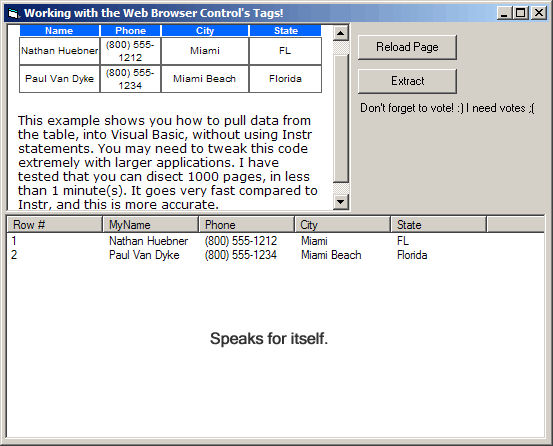



## Working with Web Browser Control and HTML Tables \- Extracting Table Data from HTML into VB

### Description

Dissecting table data from HTML, and putting it into a ListView Control. You can do anything you want with this data, and you can setup the screen to automated many different web pages, to harvest data directly into your ListView control. Saving the data is another thing, I didn't set it up, but it's very easy to figure out.
 
### More Info
 
If you use this on a different web page, please be sure to set your columns correctly. Customize your Listview, or remove it and download the data directly to INI or text files, or store it in a database. The code is only supported as is.

Data into ListView control from Web Browser Control's HTML Tables.

Not 100% supported, you have to feel your way around with this code.

             |
---                |---
**Submitted On**   |2005-10-20 19:11:36
**By**             |[Nathan A\. Huebner](https://github.com/Planet-Source-Code/PSCIndex/blob/master/ByAuthor/nathan-a-huebner.md)
**Level**          |Advanced
**User Rating**    |4.8 (43 globes from 9 users)
**Compatibility**  |VB 6\.0
**Category**       |[Internet/ HTML](https://github.com/Planet-Source-Code/PSCIndex/blob/master/ByCategory/internet-html__1-34.md)
**World**          |[Visual Basic](https://github.com/Planet-Source-Code/PSCIndex/blob/master/ByWorld/visual-basic.md)
**Archive File**   |[Working\_wi19420410202005\.zip](https://github.com/Planet-Source-Code/nathan-a-huebner-working-with-web-browser-control-and-html-tables-extracting-table-data-fr__1-62966/archive/master.zip)

